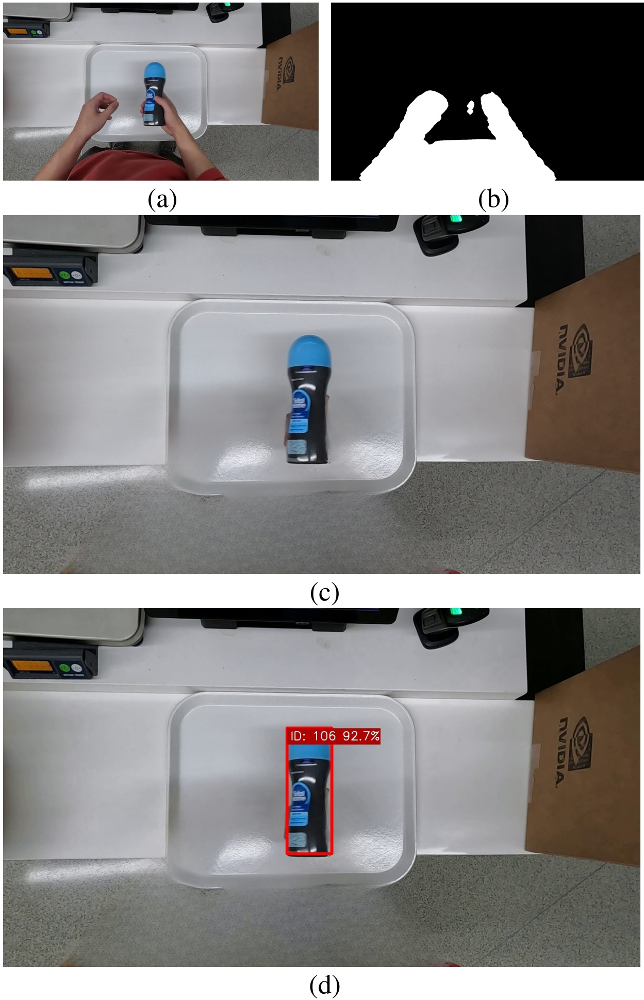

# PersonGONE: Image Inpainting for Automated Checkout Solution
Official implementaion by authors. 
Team 116 - Graph@FIT

Proposed solution for [_AI City Challenge 2022_](https://www.aicitychallenge.org/) Track4: _Multi-Class Product Counting & Recognition for Automated Retail Checkout_



Paper to [download](https://openaccess.thecvf.com) - **TBD**

### Tested environment

* Ubuntu 20.04
* Pyhton 3.8
* CUDA 11.3
* CuDNN 8.2.1
* PyTorch 1.11
* Nvidia GeForce RTX 3090

## Environment setup

Install CUDA 11.3 and CuDNN

Clone this repo: 

```bash
git clone https://github.com/BUT-GRAPH-at-FIT/PersonGONE.git
```

Create virtual environment and install dependencies
```bash
cd PersonGONE
pip install torch==1.11.0+cu113 torchvision==0.12.0+cu113 torchaudio==0.11.0+cu113 -f https://download.pytorch.org/whl/cu113/torch_stable.html
pip install mmcv-full==1.4.6 -f https://download.openmmlab.com/mmcv/dist/cu113/torch1.10.0/index.html
pip install -r requirements.txt
```
## Prepare _AI City Challenge_ dataset

#### Without training
If you do not want to train detector, only ``AIC22_Track4_TestA.zip`` (or TestB) is sufficient.

#### With training <a name="training-ref"></a>
If you want to train detector prepare data at least from Track1, Track3, and Track4 (_AI City Challenge 2022_)  

<!--Please run ``split_data.sh`` in
(**TODO**: v kazde slozce? - zkontrolovat)
> Track4/Train_SynData/segmenation_labels  

and

>Track4/Train_SynData/syn_image_train
-->

**Split data**
```bash
cd Track4/Train_SynData/segmentation_labels
bash split_data.sh
cd Track4/Train_SynData/syn_image_train
bash split_data.sh
```

## Results reproduction

### Download pre-trained model (prefered)
```bash
cd ..
python download_pretrained_models.py --detector
```

#### OR

### Train detector (can take many hours/several days)
1. Download pretrained-model models without detector  
```bash
python download_pretrained_models.py
```
2. Prepare _AI City Challenge_ dataset as [described](#training-ref)
3. Create dataset
```bash
python create_dataset.py --t_1_path {/path/to/AIC22_Track_1_MTMC_Tracking} --t_3_path {/path/to/AIC22_Track3_ActionRecognition} --t_4_track {/path/to/AIC_Track4/Train_SynData}
```
4. Train detector
```bash
python train.py  
```
Parameters ``--batch_size`` and ``--epochs`` can be set

### Inpainting process
Run:
```bash
python inpainting_process.py --video_id {/path/to/video_id.txt}
```

``video_id.txt`` file is available in ``AIC22_Track4_TestA`` and contain video IDs and video file names (in the same directory)

### Detect ROI
Run:
```bash
python detect_ROI.py --video_id ``/path/to/video_id.txt``  
```
Parameter ``--roi_seed`` can be set (two values) - it specifies seed position for ROI detection (white tray) in format ``x,y`` **TBD**

### Detect products and create submission
Run:
```bash
python detect_and_create_submission.py --video_id ``/path/to/video_id.txt``  
```
Parameters ``--tracker`` and ``--img_size`` can be set

### Hint
All scripts are set as the result was reported to _AI City Challenge_ and no arguments must be set (only ``--video_id``).

## Acknowledgements
* Instance segmentaion: [MMdetection](https://github.com/open-mmlab/mmdetection)
* Inpainting: [LaMa](https://github.com/saic-mdal/lama)
* Detector: [YOLOX](https://github.com/Megvii-BaseDetection/YOLOX)
* Trackers: [BYTE](https://github.com/ifzhang/ByteTrack), [SORT](https://github.com/abewley/sort)

## Citation
TBD
```
@inproceedings{bartl2022personGone,
title={PersonGONE: Image Inpainting for Automated Checkout Solution},
author={Bartl, Vojtěch and Špaňhel, Jakub and Herout, Adam},
TBD,
TBD,
year={2022}
}
```


# TODOs:
Nastavit spravne velikosti datasetu a epochy tranovani (ted jen na zkousku)  
Zkontrolovat nazvy a sjednotit nazvy jako _AIC22_Track4_TestA, AIC22_Track_1_MTMC_Tracking_ s oficialne stazenymi soubory
